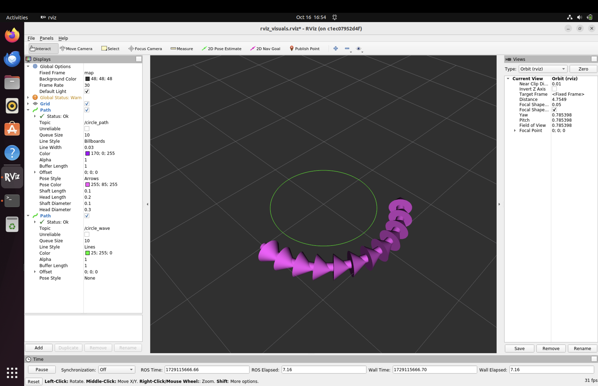

# RVIZ Visuals (rviz_visuals) ROS Package

The `rviz_visuals` package contains the RVIZ configuration files for visualizing some useful paths generated by nodes.



## Usage
```
roslaunch rviz_visuals rviz_visuals.launch
```

## Author
Alejandro Daniel José Gómez Flórez (@aldajo92)
